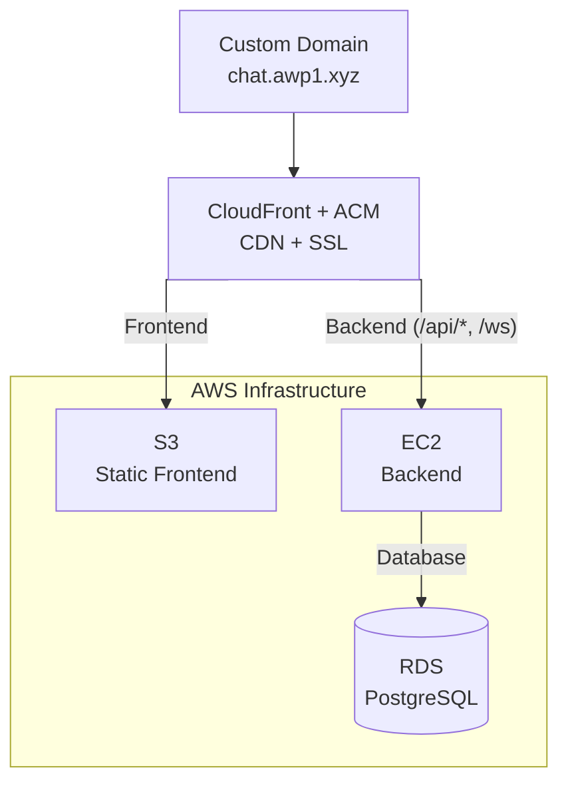
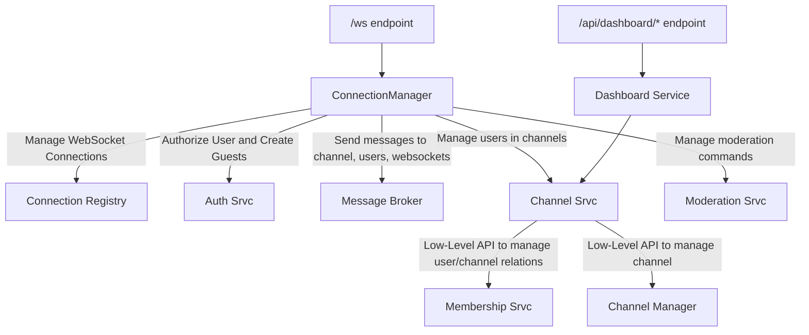

# Simple Live Chat using WebSockets

**justchat** is a real-time chat application built using WebSockets.

## Features

- Multi channel
- Multi user
- Persistent message history
- Authenticated and Guest Users
- User Presence
- Typing indicator
- Reactions
- Chat Commands (/command)
  - Kick user from channel
  - Mute user in channel (with duration and reason)
- API endpoints for a dashboard
  - Manage users.
  - Check users messages.
  - Check active channels.
  - Check all members of a channel.

## Demo

You can access the demo here: [chat.awp1.xyz](https://chat.awp1.xyz)

[](https://www.youtube.com/watch?v=whSQsNzMNC8)


## Deployment

<div align="center">



</div>

### Security

- S3 bucket is private -- accessible only via CloudFront Origin Access Control
- EC2 security group allows inbound traffic only from CloudFront
- All traffic encrypted via HTTPS/WSS (ACM certificates)
- Database in private subnet, accessible only from EC2

## Message Protocol

The chat communication is done entirely in WebSockets.

### Creating new protocols

I focused in making easy and modular when implementing new protocols.

All you need is:

1. Create a `MessageType` enum in `server/protocol/enums.py`  that will be used
to identify this protocol.
2. Create the **Payload Body** in `server/protocol/messages.py` that will
contain all the data that is needed for this protocol to work. What is
sent/received by both the client and server.
3. Create a `handler` for your protocol inside `server/handler/` that will contain
your **implementation** of the protocol.
4. And **register** this `handler` to a `MessageType` inside `server/handler/routes.py`

After this, all incoming WebSockets messages of `MessageType` will be routed to
the new `handler`

#### Dependency Injections

I also have some decorators (`server/handler/decorators.py`) that is commonly
used in the protocols, e.g., check if the user is currently in the channel,
if the user has permission, ...

- `@validate_message(MessageType)`: Validate if the message received from the
client is properly formatted.
- `@require_channel`: Check if the channel the client is requesting exists.
- `@require_membership`: Check if the user is currently in the channel.
- `@require_permission(permission)`: Check if the user has the `permission`.
- `@require_not_muted`: Check if the user is not muted.

### Protocols Format

Every message protocol (`protocol/messages.py`) is a child of the `BaseMessage`
(`protocol/basemessage`), which represents the protocol in its base form.

Every message contains a `payload` that will hold the data needed for certain
messages, e.g. a `CHAT_SEND` message will handle every message sent by
a user expects the sender's `username`, the `channel_id` and the `content`
of the message, while a `CHANNEL_JOIN` expects the `channel_id` and
an User (that is filled by the server).

That means both messages are `BaseMessage`, however their `payload` will be
their difference.

#### Validation of the Message Protocol

Validation is done *automatically* by **Pydantic** since `BaseMessage`
is created using Pydantic's `BaseModel`. And the `payload` should also
be based of `BaseModel` to ensure validation by Pydantic.

## Architecture Design



- Top-Level Object is the `ConnectionManager` that will accept a WebSocket
connection and then process every data received.
  - Ensure the first message ("hello") by the user is correct.
  - Check if its an authenticated user or creates a guest user.
  - Validate all the subsequent messages and then send then to a router
  that will handle the message.
  - Handle the disconnect by the user (closed the tab)

### Services

- The `ConnectionManager` depends on some services objects that handle
certain features.
  - `AuthenticationService` is what will authenticate an user account or
  create a guest user.
  - `ChannelService`: contains the API needed to interact with a channel. You
  can "join" an User to a channel, check if a User is in a channel, ...
    - `MembershipService` "*low-level*" API to manage the relationship between a
    user/client and the channel connected.
  - `MessageBroker`: is the service to send messages to different targets like
  user, a channel, or, if needed, a WebSocket.
  - `ModerationService` manages the chat commands related to moderation
  (`mute`, `ban`)

## Local Development

Clone the project

```bash
git clone https://github.com/berzrk666/justchat.git
```

Go to the project directory

```bash
cd justchat/
```

Copy `docker-compose.dev.yml` to `docker-compose.yml`

```bash
cp docker-compose.dev.yml docker-compose.yml
```

Edit `docker-compose.yml` and set the environment variables to your needs
or use default

Build and run the container

```bash
docker compose build
docker compose up -d
# or `docker-compose` if using older docker compose

# Or use the Makefile aliases
make dev
make run
```

To run the test environment for the frontend:

```bash
cd client/web
npm install     # Install dependencies
npm run dev     # Run
```

## Possible Improvements

- [ ] Add **Redis** for *scaling* and improve *performance*
- [ ] Improve **Reactions**
  - [ ] Keep track of who reacted
  - [ ] Persistent reactions
- [ ] Make **message protocol payload** smaller for *efficiency*
  - [ ] Use *bit fields* instead of `StrEnum` for the `MessageType`
  - [ ] Smaller fields, e.g. `user` -> `u`
- [ ] Add **pagination** for the message history
- [ ] Ban/Unban Command
- [ ] Add **more tests**
